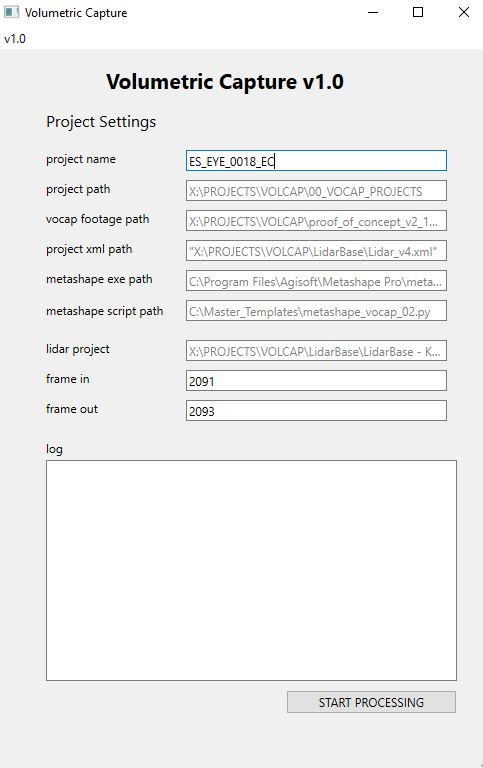
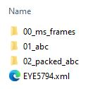
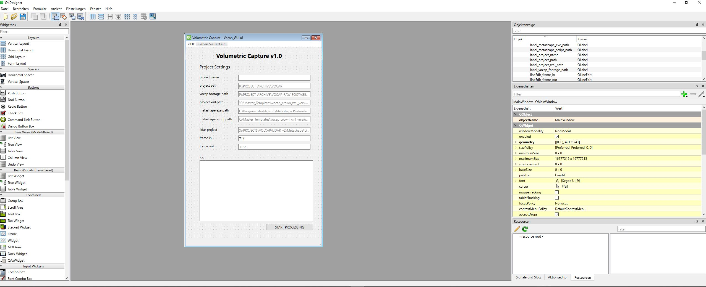

# Volumetric-Capture-Processing-Tool
The Volumetric Capture Processing Tool is a Python script with a graphical user interface (GUI) built using PySide6 and QT Designer. 
This script facilitates the management and execution of a photogrammetry pipeline using Metashape, helping to automate the processing of hundreds of frames for a volumetric capture datasets.

      ### Python Code Example
      
      ```python
    class MyMainWindow(QMainWindow, Ui_MainWindow):
        def __init__(self):
            super().__init__()
            self.setupUi(self)
    
            # Initialize log emitter
            self.log_emitter = LogEmitter()
            self.log_emitter.log.connect(self.write)
    
            # Initialize process attribute
            self.process = QProcess(self)
    
        def write(self, message):
            self.textEdit_log_status.insertPlainText(message)
    
        # Other methods and functions...
    
        def assign_variables_from_ui(self):
            # Method demonstrating object-oriented principles by encapsulating behavior
            self.project_name = self.assign_placeholder_text(self.lineEdit_project_name)
            self.project_path = self.assign_placeholder_text(self.lineEdit_project_path)
            self.vocap_footage_path = self.assign_placeholder_text(self.lineEdit_vocap_footage_path)
    
        def create_project_folder_structure(self):
            # Method demonstrating modularity and encapsulation
            if self.project_path is None:
                print("Error: Project path is not set.")
                return
            os.makedirs(self.project_path, exist_ok=True)
    
        def copy_over_master_xml(self):
            # Method demonstrating error handling and encapsulation
            try:
                shutil.copyfile(self.master_xml_path, self.project_xml_path)
            except FileNotFoundError:
                print(f"Error: Source XML file '{self.master_xml_path}' not found.")
            except Exception as e:
                print(f"Error occurred while copying XML file: {e}")
    
        # Other methods demonstrating OOP principles...
    
        def start_vocap_button_clicked(self):
            # Method demonstrating abstraction and encapsulation
            self.assign_variables_from_ui()
            self.create_project_folder_structure()
            self.copy_over_master_xml()
            self.vocap_pipeline_manager()
    
            # Exception handling and encapsulation in subprocess execution
            try:
                if sys.platform == 'win32':
                    script_result = subprocess.Popen(['python', 'metashape_vocap_02.py'], stdout=subprocess.PIPE, stderr=subprocess.PIPE, text=True)
                    for line in script_result.stdout:
                        self.write(line)
                    for line in script_result.stderr:
                        self.write(line)
                else:
                    pass
    
                if self.metashape_exe_path and self.metashape_script_path:
                    command = [self.metashape_exe_path, "-r", self.metashape_script_path, 
                            self.project_name, self.project_path, self.frame_in, 
                            self.frame_out, self.base_lidar]
                    metashape_process = subprocess.Popen(command, stdout=subprocess.PIPE, stderr=subprocess.PIPE, text=True)
                    while True:
                        stdout_line = metashape_process.stdout.readline()
                        if stdout_line:
                            self.write(stdout_line)
                        else:
                            break
                        stderr_line = metashape_process.stderr.readline()
                        if stderr_line:
                            self.write(stderr_line)
                        else:
                            break
                    metashape_process.wait()
    
            except Exception as e:
                self.write(f"Error: {e}")


The provided MyMainWindow class exhibits a strong understanding of object-oriented programming principles. Through encapsulation, modularity, and abstraction, each method fulfills a specific task, promoting readability, maintainability, and extensibility. Error handling is implemented to ensure robustness, showcasing proficiency in Python programming practices.


This user interface showcases my extensive experience with the Qt framework, reflecting a passion for UI design principles, patterns, and best practices. Leveraging proven abilities in creating mockups and rapid prototypes, this interface exemplifies a commitment to intuitive and aesthetically pleasing application design.


## Features

- **GUI Interface**: Utilizes PySide6 to create an interactive GUI for user input and status monitoring.
- **Project Folder Creation**: Automatically creates a structured project folder hierarchy. 
- **XML Management**: Copies and modifies XML configuration files for project-specific settings.
- **Job-specific Processing**: Generates job-specific JSON files and triggers the Metashape processing.

project hierarchy




qt designer project




## Demo Video
To watch a video demo of the project, click here:

[](https://youtu.be/DkoWkKtu9sE)


## Requirements

- Python 3.11+
- PySide6
- Metashape (to be installed separately)
- Supported on Windows (additional adjustments required for other platforms)

## Installation

1. Ensure you have Python 3.11 or above installed.
2. Install required Python packages:
import os, shutil, sys, re, json, subprocess
from PySide6.QtCore import QProcess, QObject, Signal  
from PySide6.QtWidgets import QApplication, QMainWindow
from Vocap_GUI import Ui_MainWindow

## Usage

run the script

python main.py

The GUI will appear, allowing you to input project details and configure processing settings.

Click the "Start VOCAP" button to initiate the automated photogrammetry processing pipeline.
